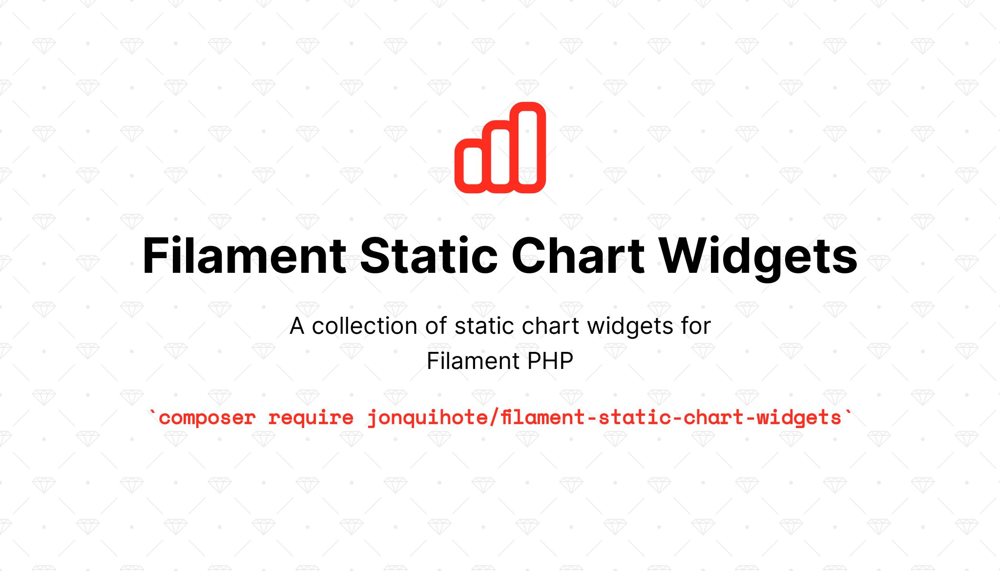
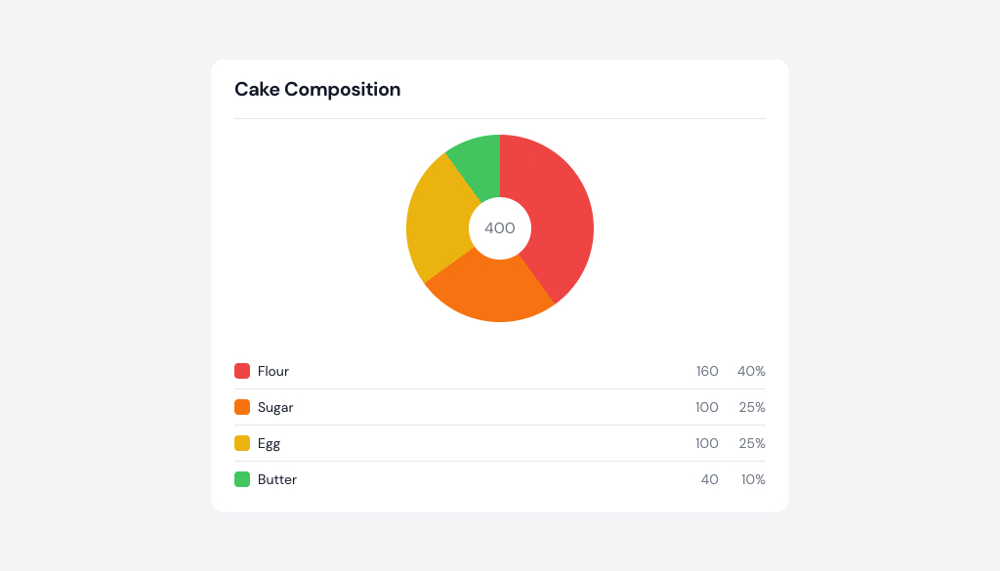
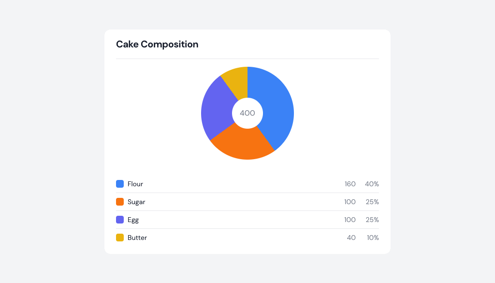

# Filament Static Stats Widget

A collection of static stats widgets for Filament PHP.

## Installation

You can install the package via composer:

```bash
composer require jonquihote/filament-static-chart-widgets
```

Optionally, you can publish the views using

```bash
php artisan vendor:publish --tag="filament-static-chart-widgets-views"
```

## Usage

```php
<?php

namespace App\Filament\Widgets;

use JQHT\FilamentStaticChartWidgets\Widgets\PieChartWidget;
use JQHT\FilamentStaticChartWidgets\Widgets\PieChartWidget\Slice;

class CakeCompositionChart extends PieChartWidget
{
    protected function getHeading():string
    {
        return 'Cake Composition';
    }

    protected function getSlices(): array
    {
        return [
            Slice::make('Flour', 160),
            Slice::make('Sugar', 100),
            Slice::make('Egg', 100),
            Slice::make('Butter', 40),
        ];
    }
}
```



If you didn't specify the color, a color will be picked from a sequence of colors that has been predefined in the codebase. By default, TailwindCSS color classes are supported and you only have to specify the name of the color.

```php
protected function getSlices(): array
{
    return [
        Slice::make('Flour', 160)->color('blue'),
        Slice::make('Sugar', 100)->color('orange'),
        Slice::make('Egg', 100)->color('indigo'),
        Slice::make('Butter', 40)->color('yellow'),
    ];
}
```



You can specify the size of the pie chart between `md`, `lg` and `xl`. (the default is `md`). In addition, you can choose to hide the label by setting `$showTotalLabel` property to `false`

```php
<?php

namespace App\Filament\Widgets;

use JQHT\FilamentStaticChartWidgets\Widgets\PieChartWidget;
use JQHT\FilamentStaticChartWidgets\Widgets\PieChartWidget\Slice;

class CakeCompositionChart extends PieChartWidget
{
    public bool $showTotalLabel = true;

    public string $size = 'md';
}
```

## Testing

```bash
composer test
```

## Changelog

Please see [CHANGELOG](CHANGELOG.md) for more information on what has changed recently.

## Contributing

Please see [CONTRIBUTING](CONTRIBUTING.md) for details.

## Security Vulnerabilities

If you discover a security vulnerability within this package, please send an e-mail to Joni Chandra via [jonquihote@gmail.com](mailto:jonquihote@gmail.com). All security vulnerabilities will be promptly addressed.

## Credits

- [Joni Chandra](https://github.com/jonquihote)
- [All Contributors](../../contributors)

## License

The MIT License (MIT). Please see [License File](LICENSE.md) for more information.
